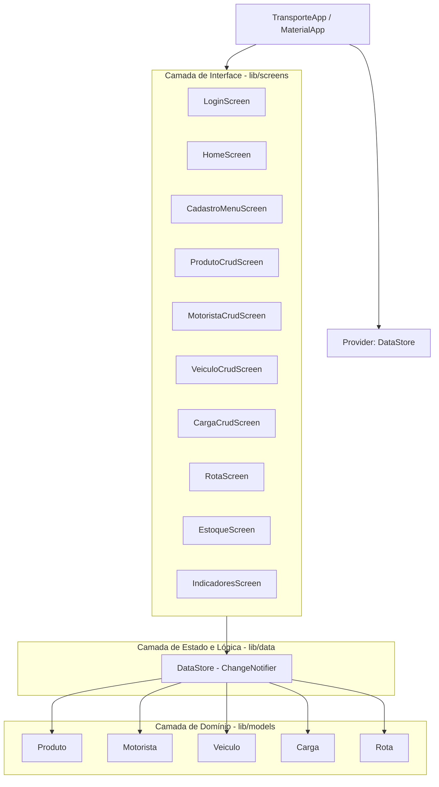
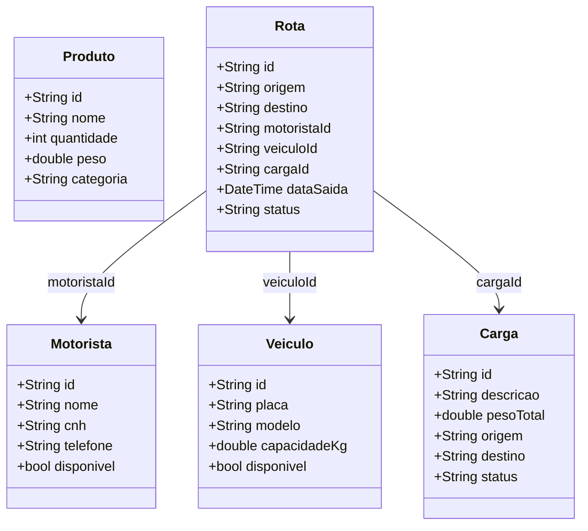

# DOC_ROTA

## 1. Visão Geral
ROTA (Rastreamento, Organização e Transporte Ágil) é uma aplicação Flutter para gestão logística com foco em:
- autenticação simples de usuário;
- cadastro de produtos, cargas, motoristas e veículos;
- planejamento de rotas vinculando esses cadastros;
- consulta de estoque e indicadores visuais.

A aplicação é **stateful em memória** (sem banco externo no estado atual) e usa Provider para gerenciamento de estado global.

## 2. Tecnologias Utilizadas

### 2.1 Linguagem e Framework
- Dart (SDK >= 3.0.0 < 4.0.0)
- Flutter (Material 3)

### 2.2 Bibliotecas Principais
- provider (^6.1.2): injeção e observação de estado global via ChangeNotifier.
- fl_chart (^0.68.0): gráficos de barras e pizza na tela de indicadores.
- cupertino_icons (^1.0.6): ícones adicionais para UI.

### 2.3 Qualidade e Testes
- flutter_lints (^4.0.0): regras de lint/análise estática.
- flutter_test: testes de widget.

### 2.4 Plataformas Suportadas
Estrutura multi-plataforma padrão Flutter no repositório:
- Android, iOS, Linux, macOS, Windows e Web.

## 3. Arquitetura da Aplicação

### 3.1 Estilo Arquitetural
Arquitetura em camadas simples (UI + Estado + Modelos):
- UI: telas em lib/screens.
- Estado e regras de negócio: lib/data/data_store.dart.
- Entidades de domínio: lib/models.

### 3.2 Injeção de Dependência / Estado
Em lib/main.dart, a aplicação usa:
- ChangeNotifierProvider(create: (_) => DataStore())

Isso torna o DataStore acessível em toda a árvore de widgets via:
- context.read<DataStore>() para comandos (escrita)
- context.watch<DataStore>() para leitura reativa

### 3.3 Navegação
Navegação por rotas nomeadas na raiz:
- /login -> LoginScreen
- /home -> HomeScreen

Dentro da HomeScreen, a navegação principal é interna por NavigationBar (índice de abas).

## 4. Estrutura de Pastas Relevante
- lib/main.dart: bootstrap, tema, rotas, provider.
- lib/data/data_store.dart: estado global e regras de CRUD/indicadores.
- lib/models/: classes de domínio.
- lib/screens/: telas de autenticação, gestão e visualização.
- assets/images/: imagens de identidade visual.
- test/widget_test.dart: teste inicial de widget da tela de login.

## 5. Fluxo Lógico da Aplicação

### 5.1 Inicialização
1. main() executa runApp(TransporteApp).
2. TransporteApp cria MaterialApp com tema e rotas.
3. Rota inicial é /login.

### 5.2 Autenticação
1. Usuário informa login/senha na LoginScreen.
2. _entrar() valida formulário e chama DataStore.login(usuario, senha).
3. Regra atual: usuário não vazio e senha fixa "1234".
4. Em sucesso: navega para /home. Em falha: exibe mensagem de erro.

### 5.3 Operação no Home
A HomeScreen apresenta:
- resumo operacional;
- acesso rápido às abas;
- logout (DataStore.logout + volta para /login).

### 5.4 Cadastros
As telas CRUD (produto, carga, motorista, veículo):
- usam bottom sheet com formulário;
- validam campos;
- chamam add/update/delete no DataStore;
- a UI atualiza automaticamente por notifyListeners().

### 5.5 Rotas
RotaScreen permite:
- criar/editar rota com origem, destino, motorista, veículo, carga, data e status;
- impedir criação se faltarem entidades básicas cadastradas;
- listar, editar e excluir rotas.

### 5.6 Estoque e Indicadores
- EstoqueScreen: busca por nome e ajuste rápido de quantidade.
- IndicadoresScreen:
  - gráfico de barras: rotas planejadas/em andamento/concluídas;
  - gráfico de pizza: estoque por categoria;
  - resumo consolidado de totais.

## 6. Modelos de Domínio

### 6.1 Produto (lib/models/produto.dart)
Finalidade: representar item estocado e usado nas operações.
Campos:
- id: identificador único.
- nome: nome do produto.
- quantidade: saldo em estoque.
- peso: peso unitário (kg).
- categoria: agrupamento para filtros/indicadores.

### 6.2 Motorista (lib/models/motorista.dart)
Finalidade: representar condutor disponível para rotas.
Campos:
- id, nome, cnh, telefone, disponivel.

### 6.3 Veiculo (lib/models/veiculo.dart)
Finalidade: representar ativo de frota.
Campos:
- id, placa, modelo, capacidadeKg, disponivel.

### 6.4 Carga (lib/models/carga.dart)
Finalidade: representar mercadoria transportada.
Campos:
- id, descricao, pesoTotal, origem, destino, status.
Status padrão: Pendente.

### 6.5 Rota (lib/models/rota.dart)
Finalidade: consolidar execução logística (quem, o quê, quando e para onde).
Campos:
- id, origem, destino, motoristaId, veiculoId, cargaId, dataSaida, status.
Status padrão: Planejada.

## 7. DataStore: Métodos e Finalidades
Arquivo: lib/data/data_store.dart

### 7.1 Sessão/Autenticação
- bool login(String usuario, String senha)
  - Finalidade: autenticar e iniciar sessão local.
  - Regra atual: senha fixa "1234" e usuário não vazio.
  - Efeito colateral: define usuarioLogado e chama notifyListeners().

- void logout()
  - Finalidade: encerrar sessão.
  - Efeito colateral: limpa usuarioLogado e notifica UI.

- bool get estaLogado
  - Finalidade: indicar se existe usuário autenticado.

### 7.2 CRUD de Produto
- void addProduto(Produto p): adiciona novo produto.
- void updateProduto(Produto p): atualiza por id.
- void deleteProduto(String id): remove por id.

### 7.3 CRUD de Motorista
- void addMotorista(Motorista m)
- void updateMotorista(Motorista m)
- void deleteMotorista(String id)

### 7.4 CRUD de Veículo
- void addVeiculo(Veiculo v)
- void updateVeiculo(Veiculo v)
- void deleteVeiculo(String id)

### 7.5 CRUD de Carga
- void addCarga(Carga c)
- void updateCarga(Carga c)
- void deleteCarga(String id)

### 7.6 CRUD de Rota
- void addRota(Rota r)
- void updateRota(Rota r)
- void deleteRota(String id)

### 7.7 Agregações/Indicadores
- int get totalProdutosEstoque
  - Soma total da quantidade de todos os produtos.

- int get rotasConcluidas
  - Conta rotas com status Concluida.

- int get rotasEmAndamento
  - Conta rotas com status Em andamento.

- int get rotasPlanejadas
  - Conta rotas com status Planejada.

- Map<String, int> get produtosPorCategoria
  - Agrupa e soma quantidades por categoria de produto.

### 7.8 Geração de IDs
- String _gerarId(String prefixo)
  - Método interno para gerar id baseado em timestamp.

- String novoId(String prefixo)
  - Interface pública para gerar id por tipo (p, m, v, c, r).

## 8. Telas: Métodos e Finalidades

### 8.1 LoginScreen (lib/screens/login_screen.dart)
Finalidade: autenticação inicial.
Métodos:
- _entrar()
  - valida formulário;
  - simula latência;
  - chama DataStore.login;
  - redireciona para /home em sucesso.
- build()
  - renderiza formulário de usuário/senha e feedback de erro/carregamento.

### 8.2 HomeScreen (lib/screens/home_screen.dart)
Finalidade: painel principal e navegação por abas.
Métodos:
- _telaInicio(): resumo com cartões e acessos rápidos.
- _cardResumo(...): componente visual para KPIs.
- _botaoRapido(...): atalho de navegação.
- build(): monta app bar, body por aba e NavigationBar.

### 8.3 CadastroMenuScreen (lib/screens/cadastro_menu_screen.dart)
Finalidade: hub para CRUDs de entidades.
Métodos:
- build(): lista itens de cadastro e navega para telas específicas.

### 8.4 ProdutoCrudScreen (lib/screens/produto_crud_screen.dart)
Finalidade: gestão completa de produtos.
Métodos:
- _abrirFormulario(...): cria/edita produto em modal.
- build(): lista produtos e oferece ações de editar/excluir/adicionar.

### 8.5 MotoristaCrudScreen (lib/screens/motorista_crud_screen.dart)
Finalidade: gestão de motoristas.
Métodos:
- _abrirFormulario(...): cria/edita motorista em modal.
- build(): lista motoristas e operações de manutenção.

### 8.6 VeiculoCrudScreen (lib/screens/veiculo_crud_screen.dart)
Finalidade: gestão da frota.
Métodos:
- _abrirFormulario(...): cria/edita veículo em modal.
- build(): lista veículos e ações de CRUD.

### 8.7 CargaCrudScreen (lib/screens/carga_crud_screen.dart)
Finalidade: gestão de cargas.
Métodos:
- _abrirFormulario(...): cria/edita carga em modal.
- _corStatus(String): define cor visual por status.
- build(): lista cargas e operações de CRUD.

### 8.8 RotaScreen (lib/screens/rota_screen.dart)
Finalidade: planejar e acompanhar rotas.
Métodos:
- _abrirFormulario(...): cria/edita rota com validações de dependências.
- build(): lista rotas e oferece ações de editar/excluir/adicionar.
- Funções locais auxiliares no build:
  - nomeMotorista(id), placaVeiculo(id), descCarga(id): resolvem labels para exibição.

### 8.9 EstoqueScreen (lib/screens/estoque_screen.dart)
Finalidade: consulta e ajuste rápido de estoque.
Métodos:
- build(): aplica filtro de busca, exibe DataTable e altera quantidades.

### 8.10 IndicadoresScreen (lib/screens/indicadores_screen.dart)
Finalidade: visualização analítica.
Métodos:
- build(): renderiza BarChart de rotas, PieChart de categorias e resumo geral.

## 9. Tema e Identidade Visual
- Tema com Material 3.
- Paleta base configurada no ColorScheme:
  - Primary: verde (#007A33)
  - Secondary: azul (#002776)
  - Tertiary: amarelo (#E5B800)
- Assets principais:
  - assets/images/logo.png
  - assets/images/bandeira-do-brasil.png

## 10. Persistência e Limitações Atuais
Estado atual:
- Sem persistência em banco local/remoto.
- Dados vivem apenas em memória durante a sessão.

Implicações:
- Ao reiniciar o app, cadastros e rotas criados em runtime são perdidos.

## 11. Testes
Arquivo: test/widget_test.dart
- Teste de widget verifica carregamento inicial da aplicação e presença dos elementos da tela de login (ROTA/Entrar).

## 12. Como Executar
1. flutter pub get
2. flutter run

Para web (exemplo Edge):
1. flutter run -d edge

## 13. Pontos de Evolução Recomendados
- Persistência com SQLite/Hive/Isar ou backend REST.
- Autenticação real (sem senha fixa).
- Camada de serviços/repositórios para separar ainda mais regras de negócio da UI.
- Testes unitários para DataStore e testes de integração de fluxos críticos.
- Internacionalização e padronização de status com enums.

## 14. Diagramas (Mermaid)

### 14.1 Arquitetura em Camadas


### 14.2 Fluxo de Navegação e Uso
```mermaid
flowchart LR
  Start[main()] --> App[TransporteApp]
  App --> Login[/login - LoginScreen]

  Login -->|Credenciais válidas| Home[/home - HomeScreen]
  Login -->|Credenciais inválidas| Login

  Home --> Aba1[Início]
  Home --> Aba2[Cadastros]
  Home --> Aba3[Rotas]
  Home --> Aba4[Estoque]
  Home --> Aba5[Indicadores]

  Aba2 --> Produtos[ProdutoCrudScreen]
  Aba2 --> Motoristas[MotoristaCrudScreen]
  Aba2 --> Veiculos[VeiculoCrudScreen]
  Aba2 --> Cargas[CargaCrudScreen]

  Produtos --> DS1[DataStore CRUD]
  Motoristas --> DS1
  Veiculos --> DS1
  Cargas --> DS1
  Aba3 --> DS1
  Aba4 --> DS1
  Aba5 --> DS1

  Home -->|Logout| Login
```

### 14.3 Relacionamento das Entidades


---
Documento gerado a partir do estado atual do código-fonte do projeto ROTA.
